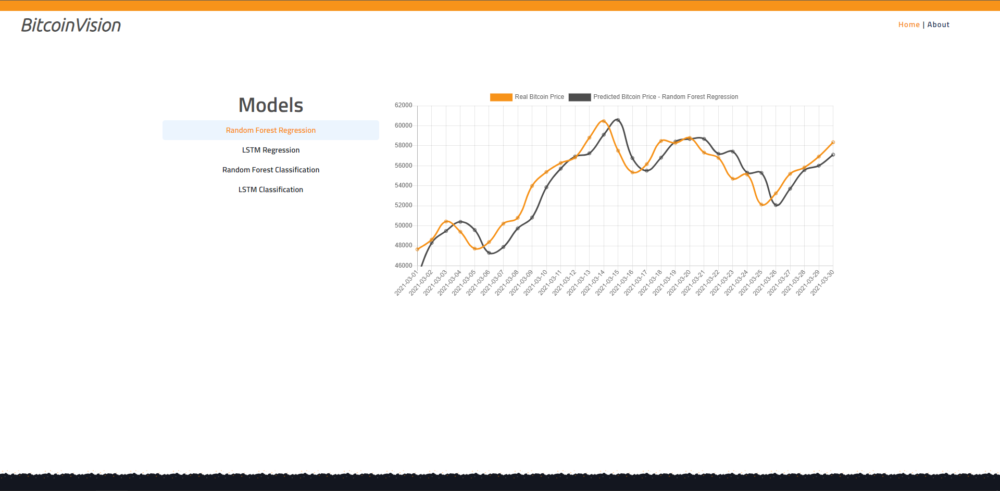
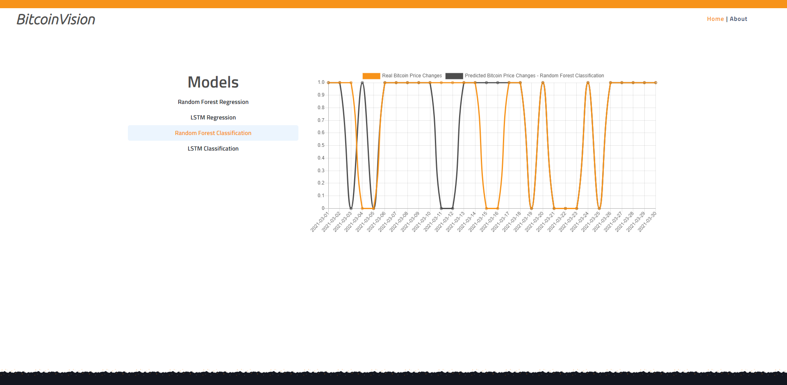

# BitcoinVision

BitcoinVision is a FYP project created by Evan Millikan as a part of Asia Pacific University Graduation Requirement. BitcoinVision achieve to help Bitcoin investors in outperforming the market by using machine learning and deep learning architecture to predict the short-term price of bitcoin. 4 models are used in predicting the next-day price of bitcoin namely Random Forest Regression, Long Short Term Memory (LSTM) Regression, Random Forest Classification, and Long Short Term Memory (LSTM) Classification. The end results achieved are the models has proven to produce satisfactory result. Random Forest Regression achieved MAE of 1319 while LSTM Regression achieved MAE of 1348. Meanwhile, Random Forest Classification achieved accuracy of 80% and LSTM Clasiffication achieved accuracy of 86%. All model passed the persistence model testing proving it is capable of predicting beyond following the last day trend.

# Features Used - Regression

| Category |            Column Name           |                                                     Description                                                     |
|:--------:|:--------------------------------:|:-------------------------------------------------------------------------------------------------------------------:|
|   input  |          miners-revenue          |                        The total size of the blockchain minus database indexes in megabytes.                        |
|   input  | estimated-transaction-volume-usd | The total estimated value in USD of transactions on the blockchain. This does not include coins returned as change. |
|   input  |       cost-per-transaction       |                         A chart showing miners revenue divided by the number of transactions                        |
|   input  |            difficulty            |                  A relative measure of how difficult it is to mine a new block for the blockchain.                  |
|   input  |             hash-rate            |        The estimated number of terahashes per second the bitcoin network is performing in the last 24 hours.        |
|   input  |            blocks-size           |                        The total size of the blockchain minus database indexes in megabytes.                        |
|   input  |       n-transactions-total       |                                 The total number of transactions on the blockchain.                                 |
|   input  |         my-wallet-n-users        |                              The total number of unique Blockchain.com wallets created.                             |
|   input  |         Volume_(Currency)        |                              Volume of corresponding currency transacted in this window                             |
|  Target  |          Weighted_Price          |                                         VWAP- Volume Weighted Average Price                                         |

# Features Used - Classification
| Category |                 Column Name                |                                                                                      Description                                                                                      |
|:--------:|:------------------------------------------:|:-------------------------------------------------------------------------------------------------------------------------------------------------------------------------------------:|
|   input  |    mvrv (market value to realised value)   | MVRV is calculated by dividing Market Value by Realised Value. In Realised Value, BTC prices are taken at the time they last moved, instead of the current price like in Market Value |
|   input  |                     Low                    |                                                                            Lowest price within time window                                                                            |
|   input  |                    High                    |                                                                            Highest price within time window                                                                           |
|   input  | nvts (network value to transaction signal) |                             NVTS is a more stable measure of NVT, with the denominator being the moving average over the last 90 days of NVT's denominator                            |
|   input  |                    Close                   |                                                                           Close price at end of time window                                                                           |
|   input  |                    Open                    |                                                                            Open price at start time window                                                                            |
|  Target  |            Label_Weighted_Price            |                 Label transformed Weighted_Price after differencing (1 if after differencing produces positive value, 0 if after differencing produces negative value)                |

# Profitability Analysis

|         Result         | Random Forest Regression | LSTM Regression | Random Forest Classification | LSTM Classification |  Buy-and-Hold |
|:----------------------:|:------------------------:|:---------------:|:----------------------------:|:-------------------:|:-------------:|
|     Initial Capital    |         $500,000         |     $500,000    |           $500,000           |       $500,000      |    $500,000   |
|  End Capital (Tax 0%)  |        $961,702.18       |  $1,058,302.92  |         $1,523,323.74        |    $2,343,778.68    | $1,706,090.54 |
|      ROI (Tax 0%)      |           92.3%          |      111.7%     |            204.7%            |        368.8%       |     241.2%    |
| End Capital (Tax 0.1%) |        $920,304.69       |  $1,047,115.78  |         $1,446,135.18        |    $1,837,936.25    | $1,703,680.77 |
|     ROI (Tax 0.1%)     |           84.1%          |      109.4%     |            189.2%            |        267.6%       |     240.7%    |
| End Capital (Tax 0.5%) |        $771,782.67       |   $915,841.95   |         $1,174,558.64        |    $1,142,381.67    | $1,694,089.64 |
|     ROI (Tax 0.5%)     |           54.4%          |      83.2%      |            134.9%            |        128.5%       |     238.8%    |
|  End Capital (Tax 1%)  |        $619,362.14       |   $599,942.09   |          $905,631.57         |    $1,304,047.21    | $1,682,207.56 |
|      ROI (Tax 1%)      |           23.9%          |      20.0%      |             81.1%            |        160.8%       |     236.4%    |
|  End Capital (Tax 2%)  |        $398,850.81       |   $323,215.44   |          $538,351.23         |     $879,357.93     | $1,658,792.87 |
|      ROI (Tax 2%)      |          -20.2%          |      -35.3%     |             7.7%             |        75.8%        |     231.8%    |

# FYP Website Sample Look

